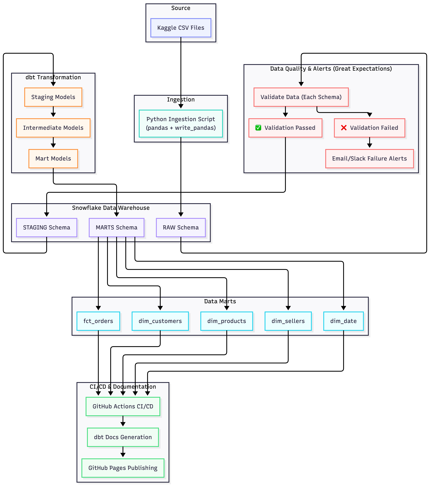
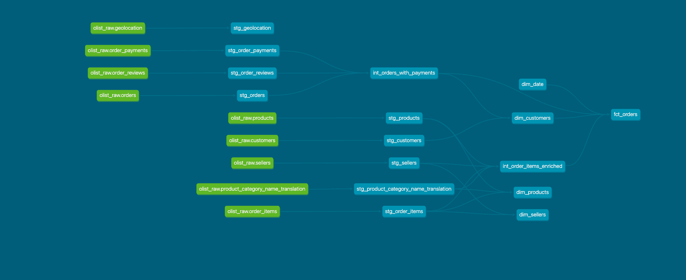

# Olist E-commerce Analytics Platform

End-to-end analytics engineering pipeline built on the Brazilian Olist e-commerce dataset.
Raw CSV data is ingested into Snowflake, validated with Great Expectations, transformed
through a layered dbt project, and documented on GitHub Pages.


## Architecture



## DBT DAG LINEAGE



## Stack

|Layer|Tool|
|---|---|
|Data warehouse|Snowflake|
|Transformation|dbt Cloud|
|Data quality|Great Expectations|
|Orchestration|GitHub Actions|
|Documentation|dbt Docs · GitHub Pages|
|Language|Python · SQL|

## Dataset

[Brazilian E-Commerce Public Dataset by Olist](https://www.kaggle.com/datasets/olistbr/brazilian-ecommerce)
— 100k orders across 9 tables, covering 2016–2018.

## Project Structure

olist-snowflake-dbt/
├── ingestion/                    # Python script to load CSVs into Snowflake RAW
├── dbt_olist/
│   ├── models/
│   │   ├── staging/              # stg_ views — rename, cast, clean
│   │   ├── intermediate/         # int_ views — join and enrich
│   │   └── marts/                # fct_ and dim_ tables — business-ready
│   ├── macros/                   # generate_schema_name override
│   └── dbt_project.yml
├── great_expectations/           # GE suites and checkpoint for RAW validation
└── .github/workflows/            # CI — dbt test on PR, dbt build on merge, docs deploy


## Data Model

### Marts layer

- `fct_orders` — one row per order with payment, delivery, and review metrics
- `dim_customers` — one row per customer with segmentation
- `dim_products` — one row per product with translated category and sales metrics
- `dim_sellers` — one row per seller with performance metrics
- `dim_date` — date spine 2016–2019

## Key Findings

- **99,441 orders** placed between September 2016 and October 2018
- **Top payment method:** credit card — used in over 70% of orders
- **Average review score:** 4.09 out of 5
- **Average delivery time:** 12 days from purchase to delivery
- **Late deliveries:** approximately 7% of delivered orders arrived after the estimated date
- **Top product category:** bed/bath/table accounting for the highest order volume
- **São Paulo** accounts for the largest share of both customers and sellers

## dbt Docs

Live dbt docs with full lineage graph:
👉 [https://pythonist4444.github.io/olist-snowflake-dbt](https://pythonist4444.github.io/olist-snowflake-dbt)

## Setup

### Prerequisites

- Snowflake account
- dbt Cloud account
- Python 3.11+

### 1. Clone the repo

```bash
git clone https://github.com/pythonist4444/olist-snowflake-dbt.git
cd olist-snowflake-dbt
```

### 2. Set up Snowflake

Run `snowflake_setup.sql` in Snowsight to create the warehouse, database,
schemas, roles, and service users.

### 3. Load raw data

```bash
cd ingestion
pip install -r requirements.txt
# create .env from .env.example and fill in your credentials
python load_to_snowflake.py
```

### 4. Run Great Expectations

```bash
great_expectations checkpoint run olist_raw_checkpoint
```

### 5. Connect dbt Cloud

- Connect dbt Cloud to your Snowflake using `OLIST_DBT_USER`
- Set target schema to `STAGING`
- Run `dbt build`

## CI/CD

| Workflow | Trigger | Action |
|---|---|---|
| dbt test on PR | Pull request to main | `dbt test` |
| dbt build on merge | Push to main | `dbt build` |
| deploy dbt docs | Push to main | `dbt docs generate` → GitHub Pages |